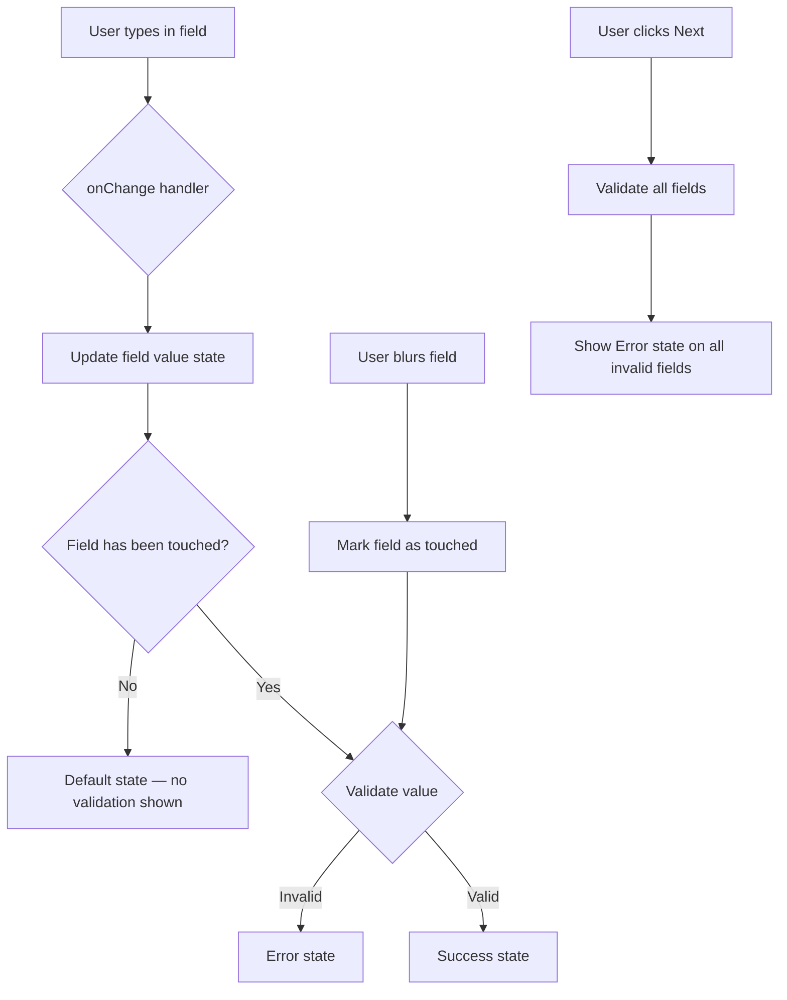

# Design Document: CreateStreamModal Validation UI States

## Overview

This feature adds validation UI states (error, hint, success, default) to the `CreateStreamModal` component. The scope is purely UI/UX — no business logic changes. Two reusable components are introduced: `InputField` (a wrapper that composes label, input container, icon, and validation message) and `ValidationMessage` (a sub-component that renders typed feedback text with an optional icon).

The existing validation logic in `CreateStreamModal.tsx` (the `validateStep1` and inline step-2 checks) is preserved as-is. The new components consume the results of that logic as props and render the appropriate visual state.

---

## Architecture

The feature introduces two new components alongside modifications to `CreateStreamModal.tsx` and `CreateStreamModal.css`.

```
src/components/
  InputField.tsx          ← new: reusable field wrapper
  ValidationMessage.tsx   ← new: reusable message sub-component
  CreateStreamModal.tsx   ← modified: use InputField for Steps 1 & 2
  CreateStreamModal.css   ← modified: add validation state CSS classes
```

No new routes, contexts, or data layers are introduced. The components are purely presentational — they accept props and render visual state.

### State Flow



### Touched-Field Tracking

The current modal uses a single shared `error` string. The new design introduces per-field touched tracking so that untouched fields never show error or success states. A `touched` record (e.g. `Record<string, boolean>`) is added to the modal's local state. Fields are marked touched on blur or on submit-attempt.

---

## Components and Interfaces

### `ValidationMessage`

A small presentational component that renders a typed message below an input.

```tsx
interface ValidationMessageProps {
  id: string;
  message: string;
  type: 'error' | 'hint' | 'success';
}
```

- `type="error"`: renders in `var(--color-danger)`, includes an error SVG icon (`aria-hidden="true"`), sets `role="alert"`.
- `type="hint"`: renders in `var(--color-text-muted)`, no icon, no role (or `role="status"`).
- `type="success"`: renders in `var(--color-success)`, includes an optional checkmark SVG icon (`aria-hidden="true"`), no role.
- Uses `var(--font-body-sm)` for typography.
- The `id` prop is used so the parent `InputField` can wire `aria-describedby`.

### `InputField`

A wrapper component that composes a label, input container, and `ValidationMessage`.

```tsx
interface InputFieldProps {
  id: string;
  label: string;
  required?: boolean;
  error?: string;        // if set, shows error state
  helperText?: string;   // shown as hint when no error
  success?: boolean;     // if true and no error, shows success state
  children: React.ReactNode; // the <input> or <div> input container
}
```

- Passes `aria-invalid`, `aria-required`, and `aria-describedby` down to the child `<input>` via `React.cloneElement` or a render-prop pattern.
- Renders `ValidationMessage` with `type="error"` when `error` is set.
- Renders `ValidationMessage` with `type="hint"` when `helperText` is set and no error is active.
- Applies CSS modifier classes to the input container: `.input-container--error`, `.input-container--success`.
- Does NOT contain validation logic — it only renders based on props.

### `CreateStreamModal` changes

- Adds `touched: Record<string, boolean>` state.
- On blur of any field: marks that field as touched.
- On `handleNext`: marks all fields for the current step as touched before running validation.
- Derives per-field `error` strings and `success` booleans from current values + touched state.
- Replaces raw `<div className="form-group">` blocks in Steps 1 and 2 with `<InputField>` wrappers.
- Removes the shared `error` banner (replaced by per-field inline errors).

---

## Data Models

No new data models. The only state additions to `CreateStreamModal` are:

```ts
// Per-field touched tracking
const [touched, setTouched] = useState<Record<string, boolean>>({});

// Helper: mark a field touched on blur
const handleBlur = (field: string) => {
  setTouched(prev => ({ ...prev, [field]: true }));
};
```

Derived validation state (not stored, computed inline):

```ts
// Example for recipient field
const recipientError = touched.recipient
  ? (!recipient.trim()
      ? 'Recipient is required.'
      : !isValidStellarAddress(recipient.trim())
      ? 'Please enter a valid Stellar address (starts with G, 56 characters).'
      : undefined)
  : undefined;

const recipientSuccess = touched.recipient && !recipientError && recipient.trim().length > 0;
```

### CSS Classes

New modifier classes added to `CreateStreamModal.css`:

| Class | Applied when |
|---|---|
| `.input-container--error` | field has an active error |
| `.input-container--success` | field passes validation after touch |
| `.validation-message` | base class for ValidationMessage |
| `.validation-message--error` | error type |
| `.validation-message--hint` | hint type |
| `.validation-message--success` | success type |

### Visual State Summary

| State | Border | Background tint | Message color | Icon |
|---|---|---|---|---|
| Default | `var(--color-border-default)` 1px | `var(--color-surface-raised)` | — | — |
| Error | `var(--color-danger)` 2px | `rgba(239,68,68,0.05)` | `var(--color-danger)` | error SVG |
| Success | `var(--color-success)` 1px | `rgba(16,185,129,0.05)` | `var(--color-success)` | checkmark SVG |
| Hint | `var(--color-border-default)` 1px | `var(--color-surface-raised)` | `var(--color-text-muted)` | — |

---

## Correctness Properties

*A property is a characteristic or behavior that should hold true across all valid executions of a system — essentially, a formal statement about what the system should do. Properties serve as the bridge between human-readable specifications and machine-verifiable correctness guarantees.*


### Property 1: Default state has no modifier classes

*For any* `InputField` rendered with no `error` prop and no `success` prop, the input container element should have neither `.input-container--error` nor `.input-container--success` class applied.

**Validates: Requirements 2.1, 2.2**

---

### Property 2: Hint renders when helperText is provided and no error is active

*For any* `InputField` with a non-empty `helperText` prop and no `error` prop, a `ValidationMessage` with `type="hint"` containing the helperText string should be rendered below the input.

**Validates: Requirements 2.3, 5.1, 5.2**

---

### Property 3: Error state applies the error modifier class

*For any* `InputField` with a non-empty `error` prop, the input container element should have the `.input-container--error` class applied (which sets the 2px danger border and background tint).

**Validates: Requirements 3.1, 3.2**

---

### Property 4: Error ValidationMessage renders the error text

*For any* `ValidationMessage` with `type="error"` and a non-empty `message` string, the rendered output should contain that message string and apply the error color class.

**Validates: Requirements 3.3**

---

### Property 5: Error icon has aria-hidden="true"

*For any* `ValidationMessage` with `type="error"`, the SVG icon element rendered alongside the message should have `aria-hidden="true"`.

**Validates: Requirements 3.4, 7.6**

---

### Property 6: Error state sets aria-invalid="true"

*For any* `InputField` with a non-empty `error` prop, the child `<input>` element should have `aria-invalid="true"`.

**Validates: Requirements 3.5, 7.2**

---

### Property 7: aria-describedby points to the active message element's id

*For any* `InputField` with either an `error` prop or a `helperText` prop, the child `<input>` element's `aria-describedby` attribute should equal the `id` of the rendered `ValidationMessage` element.

**Validates: Requirements 3.6, 7.4**

---

### Property 8: Error ValidationMessage has role="alert"

*For any* `ValidationMessage` with `type="error"`, the rendered element should have `role="alert"`.

**Validates: Requirements 3.7, 7.3**

---

### Property 9: Success state applies the success modifier class

*For any* `InputField` with `success={true}` and no `error` prop, the input container element should have the `.input-container--success` class applied (which sets the 1px success border and background tint).

**Validates: Requirements 4.1, 4.2**

---

### Property 10: Success state sets aria-invalid="false"

*For any* `InputField` with `success={true}` and no `error` prop, the child `<input>` element should have `aria-invalid="false"`.

**Validates: Requirements 4.4**

---

### Property 11: Error replaces hint — mutual exclusion

*For any* `InputField` with both a non-empty `error` prop and a non-empty `helperText` prop, only the error `ValidationMessage` should be rendered; the hint text should not appear.

**Validates: Requirements 5.3**

---

### Property 12: Hint ValidationMessage does not have role="alert"

*For any* `ValidationMessage` with `type="hint"`, the rendered element should not have `role="alert"`.

**Validates: Requirements 5.4**

---

### Property 13: label htmlFor matches input id

*For any* `InputField` with a given `id` prop, the rendered `<label>` element's `htmlFor` attribute should equal the `id` prop, and the child `<input>` element's `id` attribute should also equal the `id` prop.

**Validates: Requirements 7.1**

---

### Property 14: required=true sets aria-required="true"

*For any* `InputField` with `required={true}`, the child `<input>` element should have `aria-required="true"`.

**Validates: Requirements 7.5**

---

### Property 15: Inline validation updates on change for touched fields

*For any* field that has been touched (blurred at least once), changing the input value should immediately update the validation state to reflect the new value — transitioning between error, success, and default states as appropriate.

**Validates: Requirements 9.1, 9.3**

---

### Property 16: Blur marks field as touched and triggers validation display

*For any* field that has not been touched, triggering a blur event should mark it as touched and cause the appropriate validation state (error or success) to appear based on the current value.

**Validates: Requirements 9.2**

---

### Property 17: Submit-attempt shows errors on all invalid fields simultaneously

*For any* combination of invalid field values across a step, clicking the Next button should result in all invalid fields displaying their error state at the same time — not just the first invalid field.

**Validates: Requirements 9.4**

---

### Property 18: Untouched fields show no error or success state

*For any* field that has not been touched (no blur, no submit-attempt), the input container should have neither `.input-container--error` nor `.input-container--success` class, regardless of the current value.

**Validates: Requirements 9.5**

---

## Error Handling

Since this feature is UI-only, error handling concerns are limited to edge cases in the validation rendering:

- **Empty error string**: `InputField` should treat `error=""` the same as `error={undefined}` — no error state shown.
- **Both error and success**: `error` takes precedence; `success` is ignored when `error` is set.
- **Missing id**: If `id` is not provided, `aria-describedby` and `htmlFor` wiring cannot function. The component should require `id` as a non-optional prop (TypeScript enforcement).
- **Conditional fields (custom start date, cliff date)**: When these fields are hidden (toggle off / "Start now" selected), their validation state is cleared and they are not included in submit-time validation.
- **Step 3 read-only**: No `InputField` components are rendered in Step 3. The review cards use plain `div` elements with no validation wiring.

---

## Testing Strategy

### Dual Testing Approach

Both unit tests and property-based tests are required. Unit tests cover specific examples and integration points; property tests verify universal behaviors across all inputs.

### Unit Tests

Focus on:
- Rendering `ValidationMessage` with each `type` and verifying the correct class, role, and icon presence.
- Rendering `InputField` with each combination of `error`/`success`/`helperText` and verifying ARIA attributes.
- Integration: rendering `CreateStreamModal` at step 1, entering an invalid recipient, clicking Next, and verifying the error state appears on the recipient field.
- Integration: rendering `CreateStreamModal` at step 2, leaving all fields blank, clicking Next, and verifying all invalid fields show errors simultaneously (Property 17).
- Step 3 renders no validation classes (Property 18 / Requirement 1.3).
- Blur on an untouched field triggers validation display (Property 16).

### Property-Based Tests

Use **fast-check** (already compatible with Vitest/React Testing Library in this project's stack).

Each property test runs a minimum of **100 iterations**.

Tag format: `Feature: create-stream-modal-validation, Property {N}: {property_text}`

| Property | Test description |
|---|---|
| P1 | For any InputField with no error/success props, generate random id/label/helperText — assert no modifier classes |
| P2 | For any non-empty helperText string with no error, assert hint ValidationMessage is rendered |
| P3 | For any non-empty error string, assert .input-container--error is present |
| P4 | For any non-empty error string, assert the string appears in the rendered ValidationMessage |
| P5 | For any error string, assert the SVG icon has aria-hidden="true" |
| P6 | For any non-empty error string, assert aria-invalid="true" on the input |
| P7 | For any id + error/helperText combination, assert aria-describedby equals the message element id |
| P8 | For any error string, assert role="alert" on the ValidationMessage |
| P9 | For any success=true + no error, assert .input-container--success is present |
| P10 | For any success=true + no error, assert aria-invalid="false" on the input |
| P11 | For any error + helperText combination, assert only error message is rendered |
| P12 | For any hint message, assert role is not "alert" |
| P13 | For any id string, assert label htmlFor and input id both equal the id prop |
| P14 | For any required=true InputField, assert aria-required="true" on the input |
| P15 | For any touched field, simulate value changes and assert validation state updates |
| P18 | For any untouched field with any value, assert no error or success modifier class |

Properties 16 and 17 are tested as integration-level unit tests (specific examples) rather than property tests, since they involve multi-field modal state that is harder to parameterize meaningfully.
